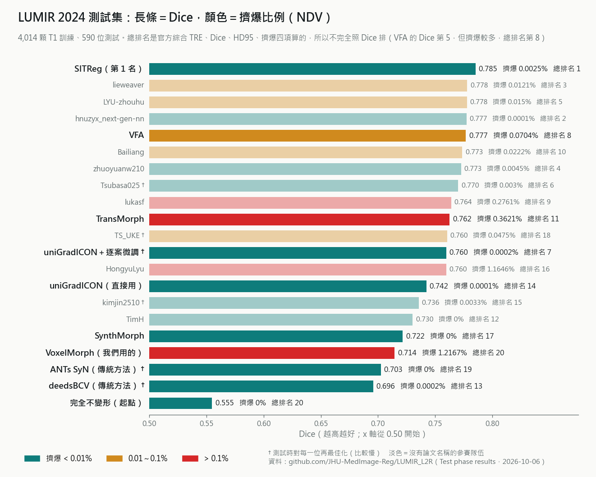
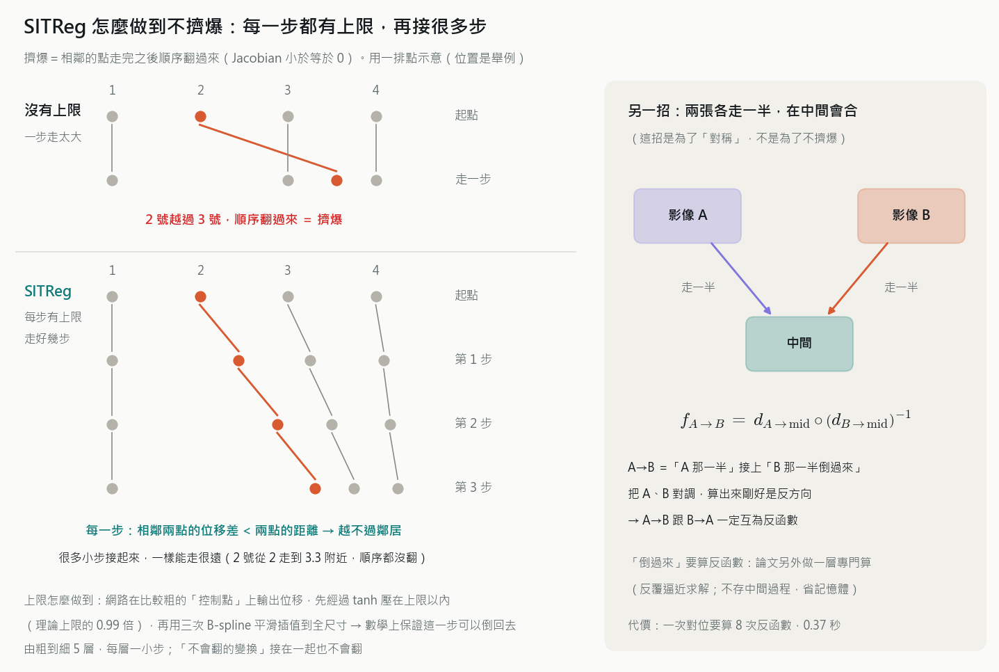
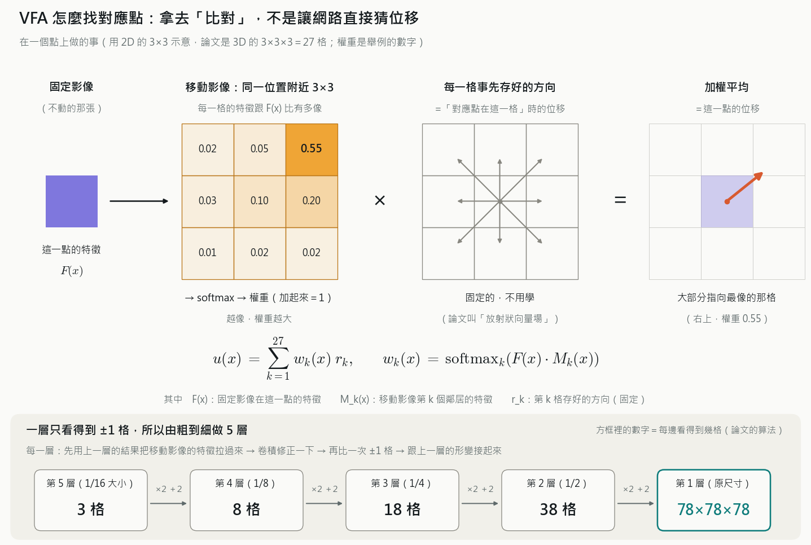

# 對位模型文獻筆記

> 這陣子查過的新論文整理在這裡：比賽排行、哪些比較熱門、模型裡面用什麼方塊、SITReg 和 VFA 怎麼做。
> **查詢日期 2026-10-06**（引用數、星星數會一直變）。數字都照論文或官方頁面抄，出處寫在每一節和文末。
> 圖和產生它們的程式在 [`img/`](img/)（`make_*.py`，改了重跑就會重畫）。

---

## 0. 先講結論

1. **VoxelMorph 還是最多人用的**（被引用 2,261 次、GitHub 星星 2,753），但在 2024 年的腦部 MRI 對位比賽 **LUMIR**
   排在最後面：Dice 0.714、擠爆 1.22%，總排名第 20，跟「完全不變形」同分（§1）。
2. **第 1 名是 SITReg**：Dice 0.785 最高，擠爆只有 0.0025%。它不靠平滑懲罰，是**架構本身**讓每一步都不會翻（§4）。
3. **VFA** 換了一種找對應點的方法：不讓網路直接猜位移，而是拿特徵去**比對**附近 27 格，再取加權平均（§5）。
   Dice 第 5 高，但擠爆 0.07%，總排名第 8。
4. **把 CNN 換成 Transformer、Mamba 幫助不大**。有用的是對位專用的設計（由粗到細、對稱、保證不翻），
   還有**訓練時用標籤**（§3、§6）。
5. ⚠️ **我們的 Dice 不能放進這些表比**：資料、標籤、結構數、對位方向都不一樣，只能看排名和趨勢。

---

## 1. LUMIR 2024：腦部 MRI 對位比賽

**是什麼**：MICCAI Learn2Reg 底下的項目（Large-scale Unsupervised Brain MRI Image Registration）。

- 訓練 4,014 顆 T1，**不給標籤**（跟我們一樣是非監督）
- 前處理：去頭骨＋仿射對齊＋N4，影像 160×224×192（跟我們很像）
- 測試 590 位，**兩個受試者互相對**（我們是受試者對 atlas）；另外還有很多「沒看過的資料」測試（不同疾病、掃描設定、物種）

| 總排名 | 方法 | Dice | 擠爆（NDV）| 說明 |
|---|---|---|---|---|
| 1 | **SITReg**（隊名 honkamj）| **0.785** | 0.0025% | §4 |
| 2 | hnuzyx_next-gen-nn | 0.777 | 0.0001% | 參賽隊伍 |
| 3 | lieweaver | 0.778 | 0.0121% | 參賽隊伍 |
| 7 | uniGradICON＋逐案微調 | 0.760 | 0.0002% | 測試時對每一位再最佳化（ISO 50）|
| 8 | **VFA** | 0.777 | 0.0704% | §5 |
| 11 | TransMorph | 0.762 | 0.3621% | Transformer 的代表 |
| 13 | deedsBCV | 0.696 | 0.0002% | 傳統方法 |
| 14 | uniGradICON（直接用）| 0.742 | 0.0001% | 不用訓練直接用的「基礎模型」|
| 17 | SynthMorph | 0.722 | 0% | FreeSurfer 內建 |
| 19 | ANTs SyN | 0.703 | 0% | 傳統方法 |
| 20 | **VoxelMorph** | 0.714 | **1.2167%** | 我們用的 |
| 20 | 完全不變形 | 0.555 | 0% | 起點 |

**怎麼看**
- 總排名是官方把 TRE（標記點距離）、Dice、HD95、擠爆四項綜合算的分數（README 沒寫公式），所以不完全照 Dice 排。
  VFA 的 Dice 第 5 高，但擠爆比較多，掉到第 8。
- VoxelMorph 的 Dice 比兩個傳統方法（ANTs、deedsBCV）高，但擠爆 1.2%，綜合分數跟「完全不變形」一樣，排最後。
- NDV（non-diffeomorphic volume）的意思跟我們的 %|J|≤0 一樣（形變翻過去的比例），但算法不完全相同，數字不要直接拿來對。
- 官方 README 有兩張表：validation（只有 baseline）和 test（參賽隊伍＋baseline）。**這裡全部用 test 那張**。

**LUMIR 2025（LUMIR25）**：改考「沒看過的資料」（高場 MRI、病人的腦、T1 對 T2 這類不同對比），訓練 3,384 位。
第 1 名（arXiv 2602.06292，2026-02）只用 T1 訓練，靠三招：MIND 損失（比局部結構、不比亮度）、
訓練時隨機改亮度、測試時對每一位再微調抽特徵的網路。

---

## 2. 哪些比較熱門

被引用次數來自 Semantic Scholar，星星數來自 GitHub，都是 2026-10-06 查的。

| 模型／論文 | 年份 | 被引用 | GitHub 星星 | 一句話 |
|---|---|---|---|---|
| **VoxelMorph** | 2019 | **2,261** | **2,753** | 我們用的，這個領域的始祖 |
| **TransMorph** | 2022 | **715** | **632** | 新論文幾乎都拿它當比較對象 |
| SynthMorph | 2022 | 287 | （放在 FreeSurfer 裡）| 用合成影像訓練，跨對比都能對 |
| SynthMorph 新版 | 2024 | 41 | — | 線性＋非線性一起做 |
| **uniGradICON** | 2024 | **83** | 234 | 2024 年後最受注意的「基礎模型」|
| Magic or Mirage | 2024 | 36 | — | 觀點論文（NeurIPS），§6 |
| multiGradICON | 2024 | 25 | — | uniGradICON 的多模態版 |
| MambaMorph | 2024 | 24 | 108 | Mamba 路線 |
| VFA | 2024 | 18 | 17 | §5 |
| SITReg | 2024 | 13 | 30 | LUMIR 2024 第 1 名，§4 |
| VMambaMorph | 2024 | 13 | 62 | Mamba 路線 |
| Mamba? Catch the Hype | 2024 | 13 | — | 觀點論文（WBIR），§6 |
| LUMIR 總結論文 | 2025 | 13 | 33 | |
| AtlasMorph | 2025 | 4 | — | §6 |
| DARE、VCoR、LUMIR25 第 1 名 | 2025–26 | 0～2 | — | 太新 |

- **熱門不等於最準**：SITReg、VFA 在 LUMIR 贏過 TransMorph 和 uniGradICON，引用和星星卻少很多。
- 越新的論文引用一定越少，2025 年以後的還看不出熱不熱門。
- uniGradICON 的星星是它自己的 repo；它底下用的程式庫 `uncbiag/ICON` 另外有 65。

---

## 3. 模型裡面用什麼方塊

差別在「一個點怎麼參考別的點的資訊」：

| 方塊 | 一個點怎麼看別的點 | 代表模型 | 現況 |
|---|---|---|---|
| **CNN（卷積）** | 只看周圍一小圈（3×3×3＝27 格），疊很多層才看得遠 | VoxelMorph、SynthMorph、uniGradICON、SITReg、VFA（抽特徵那段）| 最多人用；LUMIR 前面幾個有論文的方法都是 CNN 為主 |
| **Transformer（注意力）** | 跟一大塊區域（視窗）裡所有點比對，看得比較遠 | TransMorph、ViT-V-Net | 2022 年後很紅。TransMorph 其實是混合的：縮小那半用 Transformer，放大那半還是 CNN |
| **Mamba** | 把所有點排成一條線掃過去，邊掃邊記住前面的；看得遠，比 Transformer 省計算 | MambaMorph、VMambaMorph | 2024 年的新潮流，但有論文實測幫助不大（§6）|
| **MLP** | 用全連接層混合資訊 | CorrMLP | 比較少見 |

**我們的 VoxelMorph 是純 CNN**（[`networks.py`](../voxelmorph-code/voxelmorph/torch/networks.py)）：
- 每個方塊都是「3×3×3 卷積＋LeakyReLU(0.2)」（`networks.py:226-227`）
- 縮小用步長 2 的卷積（`:59`），放大用最近鄰插值（`:53`），再把同尺寸的特徵接過來（跳接，`:89`）
- 兩張影像一開始就疊在一起丟進網路（`:180`）
- mix_wide 的「加寬」只是把每層的濾鏡數加倍，方塊種類沒變
- **原文沒有「由粗到細」的對位**（TMI 2019 Fig. 3、§IV-A）：編碼器一層層縮小，原文說「類似傳統對位的影像金字塔」，
  但形變只在最後輸出一次、影像只搬一次，中間的粗層沒有先把影像搬過去再修。
  原文也說「最小那層的感受野至少要跟最大的位移一樣大」，以及「很多種架構可能都一樣好，架構不是這篇的重點」

**比換方塊更有用的設計**（新論文的進步大多來自這些）：
- **由粗到細**：先在小尺寸對大方向，再到大尺寸修細節（SITReg、VFA 都是）
- **重複修正**：一次對不好，就把結果再丟進網路修一次（RCN，§6）
- **架構上保證不擠爆**：SITReg 從結構上保證不翻、正反向一致，不靠損失函數去罰
- **怎麼比對兩張影像**：VoxelMorph 一開始就把兩張疊在一起；VFA 是兩張各自抽特徵，再用比對找對應點

👉 之後想試新模型，先換「由粗到細」這類設計，通常比把 CNN 換成 Transformer 或 Mamba 划算。

---

## 4. SITReg 怎麼做到不擠爆

Honkamaa & Marttinen（芬蘭 Aalto 大學），MELBA 2024。LUMIR 2024 第 1 名。程式：[honkamj/SITReg](https://github.com/honkamj/SITReg)

**一句話**：每一步都限制得夠小、數學上保證不會翻，再接很多步。不是靠平滑懲罰。

**招式一：每一步有上限**
- 網路不直接輸出每一格的位移，而是在比較粗的「控制點」上輸出，再用三次 B-spline 平滑插值到全尺寸。
- 控制點的值先經過 tanh，壓在上限 γ 以內：

  $$\gamma = 0.99 \times \frac{1}{K}$$

  其中 K 是由三次 B-spline 的形狀算出來的常數（每一層不同，論文附錄有表）；0.99 是留一點安全距離。
- 這個上限保證**相鄰兩點的位移差永遠小於兩點的距離**（圖左下）：怎麼走都越不過鄰居，所以這一步一定可以倒回去。

**招式二：由粗到細走很多步**
- 從最小的尺寸開始，每一層走一小步，一層一層往上（例如 5 層）。
- 「不會翻的變換」接在一起還是不會翻，所以總共能走很遠，順序還是對的。

**招式三：兩張各走一半，在中間會合**（為了對稱，不是為了不擠爆）
- 每一層的更新寫成

  $$\delta = u(z_1, z_2) \circ u(z_2, z_1)^{-1}$$

  其中 z₁、z₂ 是兩張影像在這一層的特徵，u 是網路。把兩張對調，δ 剛好變成 δ⁻¹。
- 最後 $f_{A\to B} = d_{A\to\mathrm{mid}} \circ (d_{B\to\mathrm{mid}})^{-1}$，所以 A→B 和 B→A **一定互為反函數**（除了很小的數值誤差）。
- 「倒過來」要算反函數，論文另外做了一層：反覆逼近求解（fixed-point iteration＋Anderson 加速），
  反向傳播用隱式微分、不存中間過程；論文說比用速度場來求反函數省約 5 倍記憶體。

**結果**（Dice）

| 資料 | SITReg | ByConstructionICON | cLapIRN | SYMNet |
|---|---|---|---|---|
| OASIS（先仿射對齊）| **0.818** | 0.813 | 0.812 | 0.788 |
| OASIS（沒對齊）| **0.813** | 0.803 | 0.744 | 0.176 |
| LPBA40 | **0.720** | 0.674 | 0.714 | 0.669 |

- **擠爆**：一般版本 OASIS 0.0081%、LPBA40 0.0024%（LUMIR 0.0025%），**不是剛好 0**——每一層重新取樣有數值誤差。
  把每一步都存下來、精確組合的「完整版」兩個資料集都是 0%。
  論文也說：號稱不會擠爆的速度場方法，在離散的格子上一樣做不到完美的 0。
- **代價**：一次對位要算 2×(層數−1) 次反函數（5 層＝8 次），推論 0.37 秒（cLapIRN 0.10 秒、SYMNet 0.095 秒，RTX 3090）；
  記憶體 3.4 GB，跟別人差不多。
- 拿掉對稱，在小資料集（LPBA40、肺部 CT）會明顯變差。

**跟我們的速度場比**
- 概念很像，都是「很多小步接起來」。我們的速度場是把速度除以 128，再讓這一小步自己接自己 7 次
  （[`ASD/img/integration_explained.png`](../ASD/img/integration_explained.png)）。
- 差別：我們每一小步**沒有硬性上限**，要靠平滑懲罰讓它夠小。所以平滑權重降到 0.5（mix_exp7）每人就開始有約 10 個擠爆點。
- SITReg 的上限是寫死的：平滑權重設多低都不會翻。**如果之後想把平滑權重再往下調、又完全不要擠爆，這種「每步上限」就是解法。**

---

## 5. VFA 怎麼找對應點

Liu、Chen、Zuo、Carass、Prince，*Journal of Medical Imaging* 11(6)，2024。程式：[yihao6/vfa](https://github.com/yihao6/vfa)

**一句話**：VoxelMorph 讓網路最後一層直接「吐出」位移數字；VFA 改成拿特徵去**比對**附近 27 格，位移＝這 27 個方向的加權平均。

**一個點上做的事**
1. 兩張影像**各自**用 U 形網路抽特徵（同一種影像時兩邊共用權重）。
2. 固定影像這一點的特徵 F(x)，跟移動影像同一位置附近 3×3×3＝27 格的特徵 M_k(x) 做內積，看有多像。
3. softmax 把 27 個「有多像」變成權重 w_k（加起來＝1）。
4. 每一格事先存好一個固定的方向 r_k（＝對應點在那一格時的位移；論文叫放射狀向量場）。
5. 位移是加權平均：

   $$u(x) = \sum_{k=1}^{27} w_k(x)\, r_k, \qquad w_k(x) = \mathrm{softmax}_k\big(F(x)\cdot M_k(x)\big)$$

   寫成注意力的樣子：Query＝固定影像的特徵、Key＝移動影像附近 27 格的特徵、**Value＝固定的方向**，即 $u = \mathrm{softmax}(QK^\top)\,R$。

- 這一步**沒有要學的參數**（方向是寫死的）。要學的只有抽特徵的網路，加上最後一個倍數 β：
  φ ＝ β·u ＋ 原位置（β 從 0.1 開始學，最後約 1）。
- 每一層的位移一定是附近幾格的加權平均，不會超出 ±1 格，比較不會亂跳（大的位移靠下面的「由粗到細」累積）。

**由粗到細 5 層**
- 一層只看得到 ±1 格，所以做 5 層（原尺寸、1/2、1/4、1/8、1/16）。
- 每一層：先用上一層的結果把移動影像的特徵拉過來 → 一層卷積修正 → 再比一次 ±1 格 →
  跟上一層的形變接起來（$\varphi^{i} = \varphi_{\mathrm{local}} \circ \varphi^{i+1}$）。
- 論文的算法：每往上一層，範圍「×2 再 +2」：3 → 8 → 18 → 38 → 78，到原尺寸時每一點的搜尋範圍是 78×78×78。

**訓練**：非監督時用 NCC（9×9×9）＋ λ × 擴散平滑項，T1 atlas 實驗 **λ = 1**
（跟 CLAUDE.md「NCC 的 λ 該在 1～2」一致）；T2→T1 用 mutual information、λ = 0.2。
輸出是一般的位移場，另有速度場版 VFA-Diff。

**結果**（IXI T1，atlas → 受試者；575 位：訓練 400／驗證 40／測試 135；132 個 SLANT 標籤；atlas 引用 Fonov 等人的 MNI 模板）

| 方法 | Dice | 擠爆（%）|
|---|---|---|
| VoxelMorph | 0.726 | 0.24 |
| VoxelMorph 速度場版 | 0.713 | < 0.01 |
| DMR | 0.763 | 0.24 |
| TransMorph | 0.774 | 0.3 |
| PR-Net++ | 0.785 | 0.12 |
| Im2grid | 0.792 | 0.04 |
| **VFA** | **0.806** | 0.06 |
| VFA 速度場版 | 0.801 | < 0.01 |

- T2→T1：VFA 0.725、TransMorph 0.660、VoxelMorph 0.593。Learn2Reg 2021：0.834 vs TransMorph 0.829。
- **代價**：參數 3.7M（VoxelMorph 0.3M、TransMorph 17.3M），計算量 1.41T FLOPs（VoxelMorph 0.61T），GPU 推論 0.9 秒。
  **記憶體吃很兇**：每一點都要存 27 個相似度，所以窗格只能 3×3×3，沒辦法試 5×5×5。

**跟我們的關係**
- 這是**跟我們 IXI 線最像的設定**（IXI T1＋MNI 那一系列的 atlas），但方向相反（它是 atlas 變形去對受試者）、
  標籤是 132 個 SLANT 結構，**Dice 不能跟我們比**。
- 速度場版只少 0.005、擠爆幾乎沒有，跟我們加寬之後的結果很像（mix_wide 0.8114 → mix_wide_vel 0.8111，擠爆 0.187% → 幾乎 0）。

---

## 6. 其他值得知道的論文

### VoxelMorph 作者群自己的後續

官方 repo 的 `citations.bib`（`dev` 分支）是作者自己維護的清單，抓了一份放在根目錄 [`voxelmorph_citations_dev.bib`](../voxelmorph_citations_dev.bib)
（`voxelmorph-code\` 裡那份是 `master` 的舊版，只到 2019）。

| 年 | 論文 | 一句話 |
|---|---|---|
| 2019 | Unsupervised Learning of Probabilistic Diffeomorphic Registration（MedIA）| 我們現在用的速度場版就是它 |
| 2019 | Learning Conditional Deformable Templates（NeurIPS）| 自己學一顆 atlas；`models\atlas_creation_*.h5` 就是這篇的 |
| 2021／2022 | **HyperMorph**（IPMI／MELBA）| 一個模型涵蓋所有 λ，不用每個 λ 各訓練一顆 |
| 2021 | Learning MRI Contrast-Agnostic Registration（ISBI）| 不受影像對比影響的對位 |
| 2022 | **SynthMorph**（IEEE TMI）| 用合成影像訓練，不需要真實影像，跨對比都能對 |
| 2023 | Anatomy-specific acquisition-agnostic affine registration（SPIE）| 線性對位也交給網路 |
| 2024 | **SynthMorph 新版**（Imaging Neuroscience）| 線性與非線性一起做 |
| 2025 | **AtlasMorph**（arXiv 2511.13609）| 依年齡、性別生成「客製化 atlas」，順便產生標籤 |

### 觀點論文（對我們下一步最有用）

前兩篇的標題都是問句，在質疑一股熱潮。

**Magic or Mirage?**（全名 *Deep Learning in Medical Image Registration: Magic or Mirage?*，NeurIPS 2024，Jena 等）
- 標題：「深度學習做對位，是**魔法**還是**海市蜃樓**？」——好處是真的（魔法），還是看起來有、走近才發現是錯覺（海市蜃樓）。
- 答案是一半一半：
  1. **不用標籤時比較像海市蜃樓**：傳統方法能對多準，跟「亮度能透露多少標籤的資訊」（亮度和標籤的 mutual information）高度相關。
     這是資料本身的限制，作者認為換網路架構也突破不了，實驗也驗證了。
     例如兩個相鄰結構亮度一樣，只看亮度的方法怎麼對都分不出邊界。
  2. **訓練時用標籤才是魔法**：網路能學到讓標籤也對齊的特徵，傳統方法做不到。
  3. **但這個魔法挑資料**：換一批分布不一樣的資料，深度學習容易掉分，傳統方法比較穩。
- 對我們：支持 mix_exp8／9（訓練時也用標籤）；也提醒用標籤訓練的模型，之後換到新的資料包要另外測。
- ⚠️ 這是一篇的看法：LUMIR 2024 不給標籤，不用標籤的 SITReg（0.785）還是明顯贏 ANTs SyN（0.703），
  LUMIR 總結論文的結論也是深度學習贏過幾個主流的傳統方法。

**Mamba? Catch the Hype or Rethink What Really Helps for Image Registration**（WBIR 2024，Jian 等）
- 標題：「Mamba？要**跟上這波熱潮**，還是**重新想想對位真正需要什麼**？」Mamba 是 2023 年底出現、2024 年很紅的新方塊（§3）。
- 背景：VoxelMorph（2018，CNN）→ TransMorph（2021，換成 Transformer，說比較好）→ MambaMorph（2024，換成 Mamba，說又更好）。
  每換一次流行的方塊就有一篇說自己更好。這篇問：真的是方塊的功勞嗎？
- 做法：同一套訓練、5 個腦部資料集（OASIS、ADNI、IXI、LPBA、Mindboggle），公平比兩種改法：

  | 改法 | 內容 | LPBA（訓練時沒看過的資料）Dice % |
  |---|---|---|
  | 基準 | VoxelMorph | 67.0 |
  | 換「更先進」的方塊 | Mamba、Transformer、大卷積核（5×5×5）| Mamba 67.5、Transformer 67.3 |
  | 加對位專用的設計 | 兩張影像各自抽特徵、由粗到細（每層先把影像拉過去再修）、算兩張局部有多像（correlation）、重複修正 | 四種全加 71.3 |

- 結論（摘要）：換方塊幾乎沒進步，多數情況還變差；對位專用的設計約 +1.5%（LPBA 上差更多）。
  作者主張先把每個元件的貢獻拆清楚，不要只追電腦視覺的流行。
- 對我們：要改模型的話，加這幾種設計比換方塊划算。SITReg、VFA 用的正是這些（兩張各自抽特徵、由粗到細；VFA 還用比對找對應點）。

其他：
- **pTVreg**（arXiv 2608.02248，2026-08，Zeybekoglu 等）：調好參數的傳統方法（用貝氏最佳化自動調），
  在肺部 CT（Lung250M-4B）反而贏過深度學習。

### 把網路串起來（重複修正）：有人做過嗎？

有，而且很有名。我們「改架構」的第 1 步就是照這篇做（§7）。

**RCN**（*Recursive Cascaded Networks for Unsupervised Medical Image Registration*，ICCV 2019，Zhao 等）
- 把 VoxelMorph（或 VTN）一顆一顆串起來：每一顆拿「到目前為止搬好的影像」再修一次。
- 每一顆有**自己的權重**、**一起訓練**；相似度只看最後搬好的影像，**每一顆的形變都罰平滑**。
- 結果（LPBA 腦部 MRI，Dice）：

  | 串幾顆 | VoxelMorph |
  |---|---|
  | 1（原本）| 0.688 |
  | 2 | 0.699 |
  | 3 | 0.706 |
  | 5 | 0.708 |

  另一種底層網路 VTN 串到 10 顆：0.686 → 0.716。串越多越好，但越後面加得越少。
- **兩個跟我們最有關的對照**：
  1. **測試時連跑好幾次（＝我們的第 0 步）**：只訓練一顆的 VTN，測試時跑 1／2／3 次 → 0.686／0.694／0.695，第 3 次幾乎沒再進步。
     訓練好的 10 顆串接再重複跑，也很快飽和（0.716 → 0.719 → 0.717）。
  2. **串起來 vs. 把一顆變大**：把一顆 VoxelMorph 每層的卷積加倍（參數跟串兩顆差不多）只有 0.689，輸給串兩顆的 0.699。
     → 我們的「串兩顆 vs. mix_wide_vel（加寬）」正好是這個對照。
- 時間：VoxelMorph 1 顆 0.15 秒、5 顆 0.41 秒（肝臟 CT）。程式：[microsoft/Recursive-Cascaded-Networks](https://github.com/microsoft/Recursive-Cascaded-Networks)
- **跟我們第 1 步一樣的地方**：腦部也是 scan-to-atlas（訓練 ADNI、ABIDE、ADHD，測 LPBA 56 個結構）、相關係數當相似度、
  各自的權重一起訓練。**不一樣的地方**：RCN 的 VoxelMorph 是**位移場版**、影像縮成 128³；
  我們每一顆用**速度場**、全尺寸 192×224×192。RCN 每一顆都在同一個解析度，**沒有由粗到細**。

**DLIR**（de Vos 等，*Medical Image Analysis* 2019）：先仿射、再由粗到細好幾段 B-spline 形變。
差別是**一段一段訓練**：前一段練好就固定、再練下一段（作者說一起訓練顯存不夠）。實驗是心臟 MRI 和胸部 CT。

**由粗到細**（我們的第 2 步）RCN 沒有，但別人做過很多：LapIRN（MICCAI 2020）、Dual-PRNet（MICCAI 2019）、
上面的 DLIR，還有 SITReg、VFA 都是。所以第 1、2 步都不是新發明；我們的價值是在同一份資料上一次只改一個地方，
把每種設計各貢獻多少、擠爆代價多少量清楚，跟加寬、調 λ 放在同一張表比（Mamba 那篇呼籲的「把貢獻拆清楚」）。

⚠️ 數字都是他們的資料（LPBA 等、不同前處理），不能跟我們的比，只看「串了有沒有進步」。

### 其他新模型

- **uniGradICON**（MICCAI 2024）／**multiGradICON**（WBIR 2024）：用 12 個公開資料集訓練的「基礎模型」，不用訓練直接用；
  也可以拿來當初始值再微調。multiGradICON 是多模態版。
- **DARE**（arXiv 2510.19353，2025-10）：會自己調整的平滑懲罰（看形變的梯度大小），再加一項專門罰擠爆。
- **VCoR**（arXiv 2602.00211，2026-01）：分好幾步逐步修正形變，用每一步的穩定程度估計「對得有多可靠」；
  測了 IXI T1，但摘要只說「差不多準」，沒給數字。
- **MambaMorph／VMambaMorph**（2024）：Mamba 路線，主要做 MR 對 CT。

---

## 7. 對我們的意義（可以做的事）

0. **改架構：不換方塊，一次加一種對位專用的設計**（2026-10-06 使用者決定先這樣做）。
   每次只改一個地方、其他都跟 mix_exp6 一樣（速度場、全尺寸、λ 1、mixed_v2、250 輪、val 挑 epoch），
   也跟 mix_wide_vel 比「改結構 vs. 單純加寬」。
   - **第 0 步**（不用訓練、試水溫）：現成模型連跑 2～3 次，`ASD/test_multipass.py`。
     10-06 結果：跑 2 次三顆都 51/51 變好（+0.008～0.009，跟 RCN 同一種測法的 +0.008 差不多），跑 3 次反而變差（手冊 §25.1）
   - **第 1 步：串兩顆**，照 RCN（各自的權重、一起訓練、相似度只看最後、每顆都罰平滑），每顆用速度場。
   - **第 2 步：由粗到細**（金字塔＋每層先把影像拉過去、兩張影像各自抽特徵），Mamba 那篇效果最大的設計。
   - 改動都做成「加上去的」：新檔案＋`--arch`，不給就是原本的 VoxelMorph。
     **老師如果希望不要改架構，整組拿掉就好**，其他實驗不受影響。
1. **訓練時也用標籤**（mix_exp8／9）：Magic or Mirage 支持這個方向，已經在排了。
2. **不用訓練的外部對照**：uniGradICON、SynthMorph 都可以直接在我們 test 51 位上跑，知道我們的模型大概落在哪裡。
3. **跟 TransMorph 比**：最常被拿來比的對象，審稿很可能會問。`D:\MyHome\MRI\TransMorph\` 已經有專案，
   用同一份 mixed_v2 跑一顆就能直接比。
4. **平滑權重想再降、又不要擠爆**：SITReg 那種「每一步有上限」是架構上的解法（§4）。
5. **VFA 有程式、測過 IXI＋MNI 類 atlas**：想在 IXI 線換新模型的話，它的設定最接近（§5）。

---

## 參考

比賽
- [Beyond the LUMIR challenge: The pathway to foundational registration models](https://arxiv.org/abs/2505.24160)（LUMIR 總結論文，*Medical Image Analysis*）
- [LUMIR_L2R GitHub](https://github.com/JHU-MedImage-Reg/LUMIR_L2R)（排行榜與 baseline；§1 的表照 Test phase results 抄）
- [Learn2Reg 2025](https://learn2reg.grand-challenge.org/learn2reg-2025/)
- [Zero-shot Multi-Contrast Brain MRI Registration by Intensity Randomizing T1-weighted MRI (LUMIR25)](https://arxiv.org/abs/2602.06292)

方法
- [SITReg（arXiv，MELBA 2024）](https://arxiv.org/html/2303.10211v5)
- [Vector Field Attention for Deformable Image Registration（VFA）](https://arxiv.org/html/2407.10209v1)
- [TransMorph](https://arxiv.org/abs/2111.10480)
- [uniGradICON](https://arxiv.org/html/2403.05780v1)、[multiGradICON](https://arxiv.org/abs/2408.00221v2)
- [SynthMorph（2024 版）](https://arxiv.org/abs/2301.11329)
- [AtlasMorph](https://arxiv.org/abs/2511.13609)、[DARE](https://arxiv.org/abs/2510.19353)、[VCoR](https://arxiv.org/abs/2602.00211)
- [MambaMorph](https://arxiv.org/abs/2401.13934)、[VMambaMorph](https://arxiv.org/abs/2404.05105)
- [Recursive Cascaded Networks（RCN）](https://arxiv.org/abs/1907.12353)（[全文 ar5iv](https://ar5iv.labs.arxiv.org/html/1907.12353)）、
  [DLIR（de Vos 等）](https://arxiv.org/abs/1809.06130)

觀點
- [Deep Learning in Medical Image Registration: Magic or Mirage?](https://arxiv.org/abs/2408.05839)
- [Mamba? Catch The Hype Or Rethink What Really Helps for Image Registration](https://arxiv.org/abs/2407.19274)
- [An Accessible Solution for Deformable Image Registration Compared with Learning-Based Approaches（pTVreg）](https://arxiv.org/abs/2608.02248)

熱門程度
- [Semantic Scholar API](https://api.semanticscholar.org/)（引用數）、各 GitHub repo（星星數）
